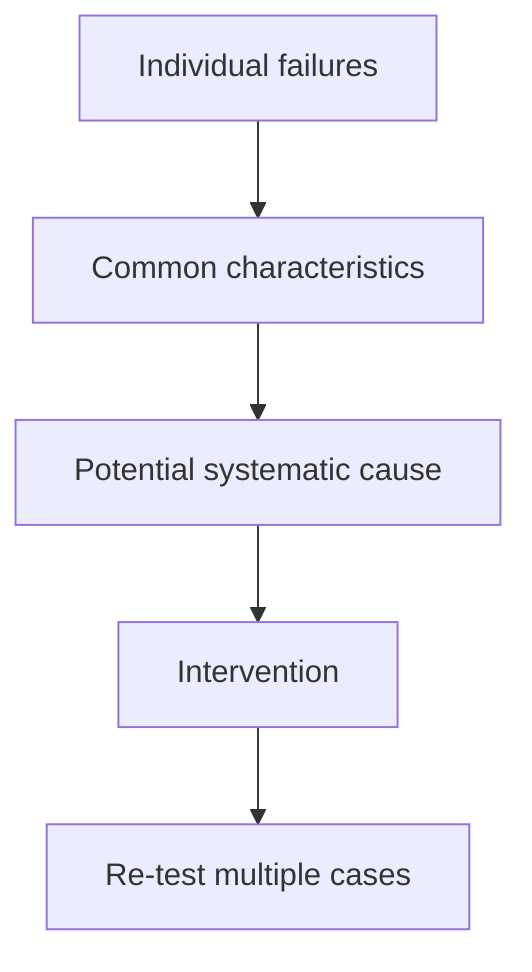

# AI Pulse Failure Analysis

## 1. Purpose

This document records and analyzes meaningful failures identified during AI Pulse
evaluation cycles.

The purpose of failure analysis is not simply to document incorrect outputs. It
is to determine **why** a failure occurred, assess its product impact, and identify
whether the appropriate intervention belongs in the prompt, evaluation design,
data, model configuration, or product experience.

Failure analysis provides the bridge between evaluation results and subsequent
product decisions.

**Evaluation results answer:**

> **What happened?**

**Failure analysis answers:**

> **Why did it happen, why does it matter, and what should we change?**

Detailed evaluation scores and iteration-level comparisons are maintained in
[`evaluation_results.md`](evals/03_evaluation_results.md).

The underlying test cases are maintained in
[`golden_dataset.json`](evals/01_golden_dataset.json), and scoring criteria are defined
in [`evaluation_rubric.md`](evals/02_evaluation_rubric.md).

---

## 2. Failure Analysis Method

Each significant failure should be analyzed using the following sequence:

```text
Observed Behavior
       ↓
Expected Behavior
       ↓
Evidence
       ↓
Failure Classification
       ↓
Root Cause Hypothesis
       ↓
Product Impact
       ↓
Intervention
       ↓
Re-evaluation
       ↓
Residual Risk
```
The analysis should distinguish between an observed failure and a
hypothesized root cause.

A failure can be directly observed from an evaluation output. Its underlying
cause may require additional testing.

Therefore:

- Observed Behavior should describe what actually happened.
- Evidence should identify the test case, source material, or evaluation
result supporting the finding.
- Root Cause Hypothesis should identify the proposed explanation and should
not be presented as proven without supporting evidence.
- Intervention should describe the change made in response.
- Result should only contain measured evidence from a subsequent evaluation.

---

## 3. Failure Taxonomy

Failures should be classified according to the primary capability that broke.

### 3.1 Factual Accuracy Failures

The output contains incorrect, distorted, incomplete, or unsupported factual
claims relative to the available source evidence.

Examples include:

- Claiming a feature exists when the source does not state this.
- Misstating what a newly released model can do.
- Adding unsupported product capabilities.
- Turning speculation into a factual statement.

### 3.2 Source Integrity Failures

The output incorrectly represents the authority, confidence, or relationship
between an output claim and its source.

Examples include:

- Presenting secondary reporting as an official announcement.
- Treating an unconfirmed report as a confirmed product release.
- Failing to prefer an official source when one is available.
- Citing a source that does not actually support the associated claim.

### 3.3 Recency Failures

The system incorrectly handles the requested time window.

Examples include:

- Surfacing an announcement outside the requested window.
- Treating the date of secondary coverage as the date of the underlying event.
- Omitting a qualifying recent update because of timestamp interpretation.
- Presenting stale information as a current update.

### 3.4 Market Relevance Failures

The system incorrectly estimates the significance of an update to the target AI
market.

Examples include:

- Assigning a high relevance score to an announcement with little practical
market impact.
- Overweighting publicity or popularity.
- Underestimating a less-publicized update with significant product or
competitive implications.
- Confusing broad AI interest with meaningful market significance.

### 3.5 Categorization Failures

The system assigns an incorrect primary category.

AI Pulse uses five categories:

Model
Feature
Funding
Viral
Other

Examples include:

- Classifying a model release as Feature.
- Using Other when the evidence supports a more specific category.

### 3.6 Summary Quality Failures

The system identifies the correct update but communicates it poorly.

Examples include:

- Excessive verbosity.
- Missing the primary development.
- Failing to communicate meaningful market implications.
- Including unnecessary background information.
- Producing a summary that is technically accurate but difficult to scan.

## 4. Failure Severity

Not every failure has the same product impact.

### Critical

A failure that materially undermines trust or causes the product to communicate false information.

**Examples:**

- Fabricated claims.
- Material factual contradictions.
- False representation of unconfirmed information as official.
- Systematic source or citation failures.

### High

A failure that can meaningfully distort the user's understanding of the AI market or significantly degrade feed quality.

**Examples:**

- Repeated high relevance scores for low-impact updates.
- Systematic inclusion of stale information.
- Major category misclassification across a recurring scenario.

### Medium

A noticeable quality issue that reduces usefulness but does not materially misrepresent the underlying information.

**Examples:**

- Moderate relevance-score errors.
- Minor category ambiguity.
- Incomplete but generally accurate summaries.

### Low

A minor presentation or interpretation issue with limited product impact.

**Examples:**

- Slightly verbose summaries.
- Minor wording imprecision that does not change meaning.
- Non-material formatting inconsistencies.

---

## 5. Failure Cases

Only documented, observed failures should be entered as completed case studies.

The cases below define the structure to use when a failure is discovered. They
should remain marked as **Pending observed evaluation** until the behavior has
actually been observed in an evaluation run.

### Failure Case FA-001 — Failure to Pull Recent Updates/Overreliance on Fallback Set

**Status:** Observed failure

#### Context

AI Pulse uses a fallback set when the primary retrieval process with the Google search tool fails or does not return
enough qualifying AI market updates for the requested time window.

The fallback mechanism is intended to preserve feed usefulness when recent
results are sparse. However, repeated use of the fallback set can create the
appearance of fresh market activity without sufficient evidence that new
qualifying updates are available.

#### Expected Behavior

The fallback set should function as a temporary recovery mechanism, not as a
persistent substitute for current market retrieval.

When the primary retrieval process does not identify enough qualifying updates,
AI Pulse may supplement the feed with fallback items according to the product's
defined fallback rules.

Repeated refreshes should not continuously present the same fallback items as
though they represent newly retrieved market activity.

When the search tool fails:

- The system may use the fallback set to preserve continuity.
- The fallback state should be identifiable to the system and, where
  appropriate, to the user.
- Repeated search failures should not silently result in the same fallback
  content being presented as though it were newly retrieved information.
- The system should detect and distinguish between **freshly retrieved results**
  and **fallback results**.
  
#### Observed Behavior

The fallback set was displayed across multiple consecutive refreshes instead of
being replaced by newly retrieved market updates.

Output (text-based render):

Timestamp: 9/17/2026 7:58 AM 

> ### [ `GEMINI` ] [ `MODEL` ]`↗ Score: 90%`
>
> ## The Latest on Gemini Models & Updates
> Google's releases for Gemini large language models (LLMs), multimodal reasoning, real-time audio and vision processing, and deep integration across Google Workspace.
>
> ---
> **✦ POPULARITY & IMPACT** `90/100`  
> `[██████████████████████████████░░░░]` **90%**
>
> ---
> <sub>🕒 Sep 18</sub> &nbsp;•&nbsp; [**Details ↗**](#)

> `CLAUDE` &nbsp; `MODEL` <span align="right">`↗ Score: 98%`</span>
>
> ## Claude 3.7 Sonnet introduces agentic coding modes
>
> Anthropic has launched Claude 3.7 Sonnet, the first hybrid reasoning model that allows users to toggle between standard and extended thinking modes. This capability significantly improves performance in complex software engineering tasks and multi-step creative workflows.
>
> ---
>
> ✧ **POPULARITY & IMPACT** <span align="right">**98/100**</span>  
> `█████████████████████████████████████████████████░`
>
> ---
>
> ◷ SEP 17 <span align="right">[**Details ↗**](#)</span>

> `CHATGPT` &nbsp; `MODEL` <span align="right">`↗ Score: 95%`</span>
>
> ## OpenAI Introduces o3-mini for High-Level Reasoning
>
> The new o3-mini model is optimized for complex logical workflows and creative brainstorming, providing faster inference times. It allows creators to iterate on interactive scripts and storyboard logic with greater precision.
>
> ---
>
> ✧ **POPULARITY & IMPACT** <span align="right">**95/100**</span>  
> `████████████████████████████████████████████████░░`
>
> ---
>
> ◷ SEP 17 <span align="right">[**Details ↗**](#)</span>


#### Why It Matters

AI Pulse is intended to reduce information overload. If publicity is treated
as a proxy for importance, high-noise announcements can displace developments
with greater practical or strategic significance.

#### Root Cause Hypothesis

The relevance logic may over-weight popularity, publicity, or volume of coverage
relative to practical market impact.

#### Evidence

- **Golden dataset case:** TC-006
- **Observed relevance score:** 98
- **Expected relevance range:** 80-100

#### Product/System Intervention

Purge Time-Sensitive Fallback Items: Removed all static, event-driven news announcements (e.g., specific version launches or time-bound events) from the active fallback database pool.

- Implement Evergreen Content Pool: Populated the fallback repository exclusively with high-level, generic updates and primers (e.g., model architecture primers, regulatory frameworks, AI landscape overviews) that remain accurate over extended timeframes.
Purge Time-Sensitive Fallback Items: Removed all static, event-driven news announcements (e.g., specific version launches or time-bound events) from the active fallback database pool.

- Implement Evergreen Content Pool: Populated the fallback repository exclusively with high-level, generic updates and primers (e.g., model architecture primers, regulatory frameworks, AI landscape overviews) that remain accurate over extended timeframes.
Potential interventions may include:

#### Result

Timeliness Compliance: 100% elimination of stale news items masquerading as breaking updates during search outages.

#### Residual Risk

- Content Fatigue: If primary search experiences sustained downtime, users will repeatedly see the same static evergreen primers unless the evergreen pool is routinely rotated.

- User Value Perception: Generic background content provides less immediate actionable value than real-time news, which may reduce engagement during extended search API outages.

---

### Failure Case FA-002 [Example template] — High Publicity, Low Market Relevance

**Status:** Pending observed evaluation

#### Context

The system surfaces an AI announcement that receives substantial public
attention but has limited practical significance to the target AI market.

#### Expected Behavior

The system should assign a moderate or low market relevance score when the
announcement does not materially affect products, capabilities, workflows,
adoption, competition, or market direction.

#### Observed Behavior

[Document the actual output and relevance score.]

#### Why It Matters

AI Pulse is intended to reduce information overload. If publicity is treated
as a proxy for importance, high-noise announcements can displace developments
with greater practical or strategic significance.

#### Root Cause Hypothesis

The relevance logic may over-weight popularity, publicity, or volume of coverage
relative to practical market impact.

#### Evidence

- **Golden dataset case:** [TC-XXX]
- **Observed relevance score:** [XX]
- **Expected relevance range:** [XX–XX]

#### Product/System Intervention

[Document the change made.]

Potential interventions may include:

- Revising the relevance definition.
- Adjusting prompt instructions.
- Adding explicit market-impact criteria.
- Adding evaluation cases designed to separate publicity from significance.

#### Result

[Document measured result after re-evaluation.]

#### Residual Risk

[Document remaining uncertainty.]

## 6. Cross-Failure Patterns

Once multiple evaluation cycles have been completed, recurring failures should be analyzed across cases rather than treated independently.

| Pattern | Affected Cases | Frequency | Severity | Likely Cause | Intervention |
| :--- | :--- | :--- | :--- | :--- | :--- |
| *TBD* | *TBD* | *TBD* | *TBD* | *TBD* | *TBD* |

---

### Pattern Analysis

Recurring failures should be investigated for evidence of systematic behavior.



## 7. Product Implications

Failure analysis should translate technical or model behavior into product implications.

| Dimension | Key Question |
| :--- | :--- |
| **User Impact** | How does the failure affect the user's experience or decision-making? |
| **Product Impact** | How does the failure affect the value proposition or trustworthiness of AI Pulse? |
| **Risk** | What happens if the failure remains unresolved? |
| **Priority** | Why should this failure be addressed now versus later? |

---

### Prioritization Framework

A useful framework for evaluating and prioritizing failure resolution:

$$\text{Prioritization} = \text{Impact} \times \text{Frequency} \times \text{Trust Risk}$$

> [!IMPORTANT]
> A low-frequency failure may still warrant immediate attention when its trust impact is high.

---

## 8. Prompt / System Changes

Each intervention should be recorded here after it has been implemented.

| Change ID | Failure Addressed | Intervention | Type | Expected Effect | Measured Result |
| :--- | :--- | :--- | :--- | :--- | :--- |
| `CHG-001` | TBD | TBD | `Prompt` | TBD | TBD |
| `CHG-002` | TBD | TBD | `Retrieval` | TBD | TBD |
| `CHG-003` | TBD | TBD | `Product` | TBD | TBD |

### Intervention Types

Use the following labels where applicable:

* `Prompt`
* `System`
* `Retrieval`
* `Data`
* `Model`
* `Product`
* `Evaluation`

> [!NOTE]
> This classification helps distinguish a prompting problem from a problem that requires a broader product or technical intervention.

---

## 9. Failure Analysis Principles

AI Pulse failure analysis follows five principles:

1. **Evidence before explanation**  
   Document what happened before proposing why it happened.

2. **Hypotheses are not facts**  
   Root causes should be labeled as hypotheses until supported by testing.

3. **Fix the right layer**  
   Not every AI failure should be solved with prompt changes.

4. **Measure the intervention**  
   A proposed fix is not validated until subsequent evaluation demonstrates improvement.

5. **Preserve failure history**  
   Resolved failures should remain documented so future iterations can avoid regressions.
