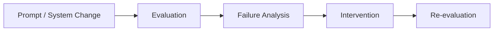

# AI Pulse Evaluation Rubric

## 1. Purpose

This rubric defines how AI Pulse outputs are evaluated against the golden dataset.

The objective is to establish a repeatable, evidence-based standard for assessing
whether the system can identify meaningful AI market updates, accurately represent
their source material, classify them consistently, assess their market relevance,
and produce concise, useful summaries.

The rubric is designed to be applied consistently across prompt iterations,
model changes, and other system interventions.

The rubric defines evaluation criteria and scoring rules; it does not contain
evaluation results.

## 2. Evaluation Objective

The core evaluation question is:

> Can AI Pulse reliably identify meaningful recent AI market updates and
> transform them into accurate, appropriately categorized, market-relevant
> summaries with valid source attribution?

The evaluation focuses on six dimensions:

1. Factual Accuracy
2. Source Integrity
3. Recency
4. Market Relevance
5. Categorization
6. Summary Quality

## 3.1 Factual Accuracy

### What It Measures

Whether the output accurately represents the material facts contained in
the supporting source evidence.

### Why It Matters

AI Pulse is an information product. Incorrect or unsupported factual claims
can reduce user trust and make otherwise useful market intelligence unreliable.

### Scoring

| Score | Definition |
|---|---|
| 5 | All material claims are accurate, supported by the source, and free of meaningful distortion. |
| 4 | Substantially accurate with minor imprecision that does not change the meaning. |
| 3 | Generally accurate but contains notable omissions, ambiguity, or imprecision. |
| 2 | Contains one or more material unsupported, misleading, or inaccurate claims. |
| 1 | Materially contradicts the source or invents significant information. |

### Evaluation Rules

- Evaluate claims against the source evidence, not against outside assumptions.
- Do not penalize wording differences when the underlying meaning is accurate.
- Unsupported additions should lower the score even when the core announcement is correctly identified.

## 3.2 Source Integrity

### What It Measures

Whether the output uses and represents source information appropriately,
including accurate attribution and appropriate handling of source confidence.

### Why It Matters

AI Pulse may encounter official announcements, secondary reporting,
and unconfirmed information. The system should not present these sources
as equivalent levels of evidence.

### Scoring

| Score | Definition |
|---|---|
| 5 | Source is correctly represented, appropriately attributed, and claims are fully supported. |
| 4 | Source handling is substantially correct with minor attribution or framing issues. |
| 3 | Source is identifiable but confidence or attribution is insufficiently clear. |
| 2 | Output materially overstates the authority or certainty of the source. |
| 1 | Source is misrepresented, fabricated, or used to support claims it does not contain. |

### Evaluation Rules

- Official announcements should be represented as official sources.
- Secondary reporting should not be presented as official confirmation.
- Unconfirmed reports must not be represented as confirmed product releases.
- The system should prefer an official source when the same announcement is
  available through multiple sources.

## 3.3 Recency

### What It Measures

Whether the update falls within the requested time window.

### Why It Matters

AI Pulse is intended to surface recent AI market developments. A relevant
announcement should still be excluded when it falls outside the requested
recency window.

### Scoring

| Score | Definition |
|---|---|
| 5 | Update clearly falls within the requested time window. |
| 4 | Update falls within the window with minor timestamp ambiguity. |
| 3 | Timing is unclear and requires additional interpretation. |
| 2 | Update is outside the requested window but is incorrectly surfaced as current. |
| 1 | Update is materially stale or the timestamp is incorrectly represented. |

### Evaluation Rules

The requested time window is evaluated against the source publication timestamp.

Relevance does not override the recency requirement.

For example, an otherwise highly relevant update published outside a requested
48-hour window should not be included unless the product's rules explicitly
allow resurfacing older information.

## 3.4 Market Relevance

### What It Measures

Whether the update has meaningful implications for the AI market represented
by AI Pulse and its target audience.

Market relevance considers the practical significance of the update rather than
simply its level of publicity or general attention.

### Why It Matters

A high-volume AI news environment can cause highly publicized announcements to
receive disproportionate attention even when they have limited practical impact.
AI Pulse should prioritize developments that materially affect products,
capabilities, workflows, competition, adoption, or market direction.

### Scoring

| Score | Definition |
|---|---|
| 5 | Clearly significant to the target AI market with strong practical or strategic implications. |
| 4 | Meaningfully relevant with identifiable market or product implications. |
| 3 | Moderately relevant but with limited or indirect implications. |
| 2 | Weak market relevance; limited practical significance. |
| 1 | Little or no meaningful relevance to the target market. |

### Evaluation Considerations

Evaluate relevance using evidence such as:

- Magnitude of the product or capability change
- Applicability to the target market
- Potential impact on workflows or adoption
- Competitive or strategic significance
- Novelty relative to existing capabilities
- Evidence of meaningful market interest

Popularity or publicity may contribute to relevance but should not determine it by itself.

## 3.5 Categorization

### What It Measures

Whether the update is assigned to the most appropriate AI Pulse category.

### Categories

| Category | Definition |
|---|---|
| **Model** | A new or materially updated AI model or model family is the primary announcement. |
| **Feature** | A new or materially changed product capability or workflow feature is the primary announcement. |
| **Funding** | The central update concerns investment, fundraising, acquisition-related financing, or similar capital activity. |
| **Viral** | The central significance of the update is rapid market attention or emerging adoption rather than a conventional product announcement. |
| **Other** | The update does not fit the other categories or lacks sufficient evidence for a more specific classification. |

### Scoring

| Score | Definition |
|---|---|
| 5 | Correct primary category with clear supporting rationale. |
| 4 | Reasonable category with minor ambiguity. |
| 3 | Plausible but debatable classification. |
| 2 | Incorrect category but related to the underlying announcement. |
| 1 | Clearly incorrect or unsupported category. |

### Evaluation Rule

Classification should be based on the primary significance of the announcement,
not simply on every capability or topic mentioned in the source.

When multiple categories are plausible, the evaluator should determine which
category best represents the central product or market event.

## 3.6 Summary Quality

### What It Measures

Whether the resulting summary communicates the important information clearly,
concisely, and usefully.

### Scoring

| Score | Definition |
|---|---|
| 5 | Concise, clear, complete, and immediately useful. |
| 4 | Strong summary with minor omissions or verbosity. |
| 3 | Understandable but requires additional interpretation or contains unnecessary detail. |
| 2 | Difficult to scan, incomplete, or overly verbose. |
| 1 | Misleading, incoherent, or fails to communicate the update meaningfully. |

### Evaluation Rules

A strong summary should:

- Identify what changed.
- Identify the relevant product, company, or development.
- Communicate the meaningful market implication when supported by evidence.
- Avoid unsupported speculation.
- Avoid unnecessary detail.

## 4. Golden Dataset Design

### 4.1 Purpose

The golden dataset defines a controlled set of known scenarios used to evaluate
AI Pulse consistently across prompt and model iterations.

The dataset is designed around product behaviors rather than simply a collection
of AI news examples.

Each test case establishes:

- The evaluation context
- The supporting evidence
- The expected system behavior
- Important facts that should be preserved
- Claims that should not be introduced
- Edge-case handling requirements

### 4.2 Schema Design Rationale

The schema separates **source evidence**, **evaluation context**, and
**expected behavior**.

This prevents the evaluator from judging an output solely on whether it
"looks good" and instead allows the system to be evaluated against explicit
product requirements.

| Field | Purpose | Primary Evaluation Dimension |
|---|---|---|
| `input` | Defines evaluation context such as time window and target market | Recency, Market Relevance |
| `source` | Establishes the evidence used to judge factual claims | Factual Accuracy, Source Integrity |
| `expected.should_include` | Establishes whether the update belongs in the feed | Recency, Market Relevance |
| `expected.category` | Defines the correct AI Pulse classification | Categorization |
| `expected.relevance_score_range` | Defines an acceptable relevance range without requiring false numerical precision | Market Relevance |
| `expected.key_facts` | Identifies facts the output should preserve | Factual Accuracy |
| `expected.must_not_claim` | Defines unsupported claims the output must avoid | Factual Accuracy, Source Integrity |
| `expected.market_impact` | Captures expected significance | Market Relevance |
| `expected.exclusion_reason` | Explains why an otherwise relevant item should not be surfaced | Recency, Market Relevance |
| `expected.category_rationale` | Documents why a potentially ambiguous item belongs in a category | Categorization |
| `source_integrity_requirement` | Defines how source confidence should be communicated | Source Integrity |
| `deduplication` | Defines expected handling of multiple reports about one event | Source Integrity, Summary Quality |

## 5. Overall AI Quality Score

Each dimension is scored from 1–5 and weighted according to its importance
to the AI Pulse product.

| Dimension | Weight |
|---|---:|
| Factual Accuracy | 30% |
| Source Integrity | 20% |
| Market Relevance | 20% |
| Recency | 10% |
| Categorization | 10% |
| Summary Quality | 10% |
| **Total** | **100%** |

### Rationale for Weighting

Factual Accuracy receives the highest weighting because AI Pulse is fundamentally
an information-trust product.

Source Integrity receives the second-highest weighting because the value of a
market update depends on the user's ability to understand where the information
came from and how confidently it can be interpreted.

Market Relevance receives substantial weight because AI Pulse should prioritize
meaningful developments rather than simply maximizing the number of updates surfaced.

Recency, Categorization, and Summary Quality remain important supporting dimensions
but should not compensate for inaccurate or poorly sourced information.

## 6. Evaluation Decision Framework

Evaluation results should be used to identify whether the current system:

1. Meets the minimum quality bar.
2. Requires targeted prompt or system changes.
3. Produces unacceptable failure modes that require product intervention.

### Decision Rules

A system should not be considered ready for the next stage of deployment
solely because its weighted score improves.

Review should also consider:

- Material factual errors
- Unsupported claims
- Incorrect inclusion of stale information
- Incorrect inclusion of low-relevance information
- Systematic category errors
- Repeated source-integrity failures

A higher aggregate score does not compensate for critical trust failures.

## 7. Evaluation Process

Each evaluation cycle follows the same sequence:

1. Select the prompt/model configuration being evaluated.
2. Run the same golden dataset against that configuration.
3. Score outputs using this rubric.
4. Aggregate dimension-level and overall results.
5. Identify recurring failure modes.
6. Determine whether a prompt, system, product, or data change is required.
7. Re-run the evaluation against the same golden dataset.
8. Document the resulting change in `evaluation_results.md`.
9. Document material failures and their causes in `failure_analysis.md`.

This process creates a repeatable feedback loop:

